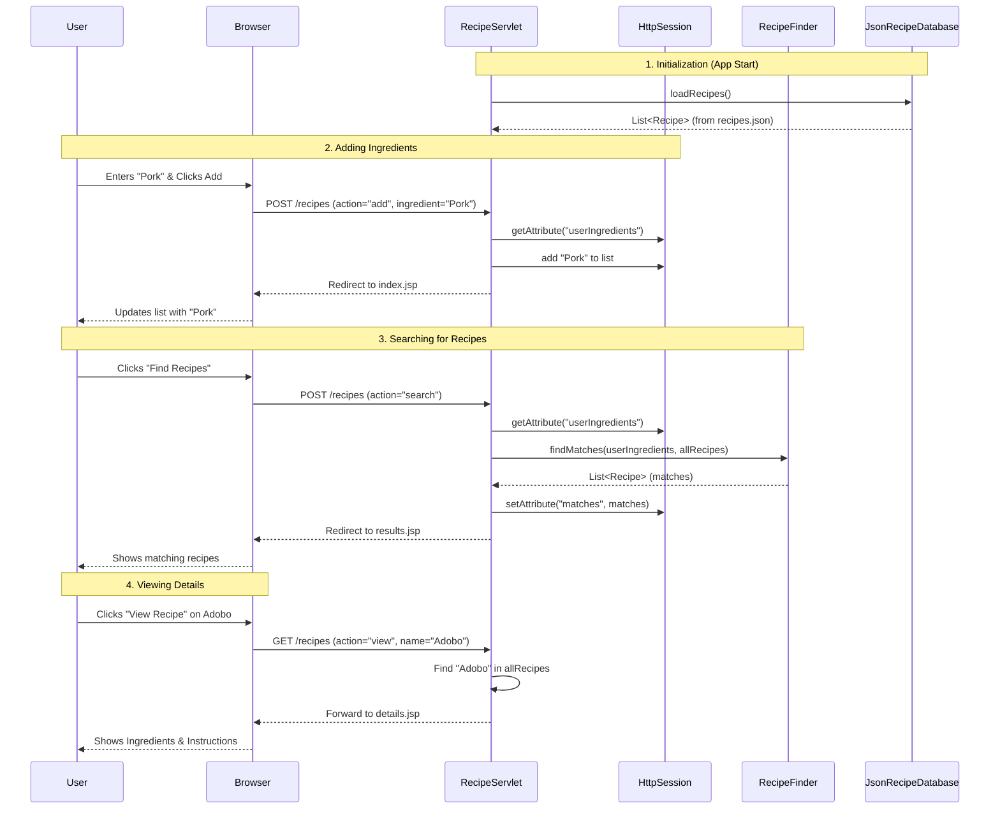

# Data Flow & Architecture - Unsay Sud-anon

This document explains the flow of data and code execution within the Unsay Sud-anon application.

## Architecture Overview (MVC)
The application follows the **Model-View-Controller (MVC)** design pattern:

-   **Model**: Represents the data and logic.
    -   `Recipe`: Data object (POJO).
    -   `RecipeDatabase` / `JsonRecipeDatabase`: Handles data loading.
    -   `RecipeFinder`: Contains the matching logic.
-   **View**: The user interface.
    -   `index.jsp`: Input screen.
    -   `results.jsp`: List of matches.
    -   `details.jsp`: Single recipe view.
-   **Controller**: Manages flow.
    -   `RecipeServlet`: Handles all HTTP requests and orchestrates the Model and View.

## Data Flow Diagram

## Detailed Code Flow

### 1. Application Startup
-   When the server starts (or first request hits), `RecipeServlet.init()` is called.
-   It initializes `JsonRecipeDatabase` which reads `src/main/resources/recipes.json`.
-   The JSON data is parsed into a `List<Recipe>` and stored in memory (`allRecipes`).

### 2. User Interaction Cycle
The `RecipeServlet` acts as the traffic cop, handling two main types of requests:

#### POST Requests (`doPost`)
Used for state changes (modifying the session).
-   **Action `add`**:
    -   Reads `ingredient` parameter.
    -   Retrieves `userIngredients` list from `HttpSession`.
    -   Adds the new ingredient.
    -   Redirects back to `index.jsp`.
-   **Action `search`**:
    -   Retrieves `userIngredients` from Session.
    -   Calls `RecipeFinder.findMatches()`.
    -   **Matching Logic**: Checks if the recipe contains "All or Most" (>= 50%) of the user's ingredients.
    -   Stores the resulting list in Session as `matches`.
    -   Redirects to `results.jsp`.
-   **Action `clear`**:
    -   Removes attributes from Session.
    -   Redirects to `index.jsp`.

#### GET Requests (`doGet`)
Used for navigation.
-   **Action `view`**:
    -   Reads `name` parameter (e.g., "Adobo").
    -   Searches the in-memory `allRecipes` list for that name.
    -   Sets the found `Recipe` object as a Request Attribute (`req.setAttribute("recipe", ...)`).
    -   **Forwards** (not redirects) to `details.jsp` so the JSP can access the request attribute.

## State Management
-   **Session Scope**: Used for `userIngredients` (so they persist across multiple "Add" clicks) and `matches` (so they persist on the results page).
-   **Request Scope**: Used for the single `recipe` object when viewing details.
